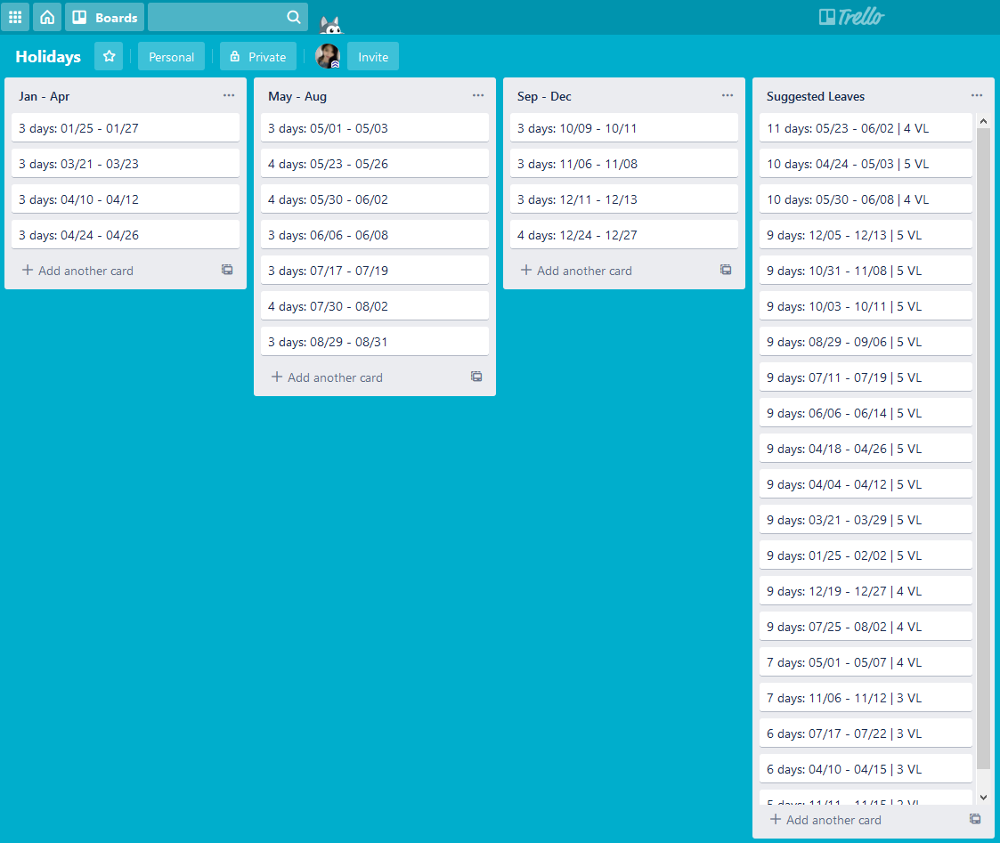

# Holiday Planner
Scrapes holiday dates, checks for long weekends, and suggests efficient leave filing to get the longest vacation days.
Vacation leave suggestions and schedules are posted to a Trello board where they can be further reviewed.

## Getting Started

Install the required modules:
```
pip install -r requirements.txt
```

Get your key and token from https://trello.com/app-key and modify the trello.py file:
```
key = "your_key"
token = "your_token"
```

Run the main script:
```
python holidays.py
```

It will automatically create a board named "Holidays" in your Trello including the lists and cards of suggested vacation dates.

